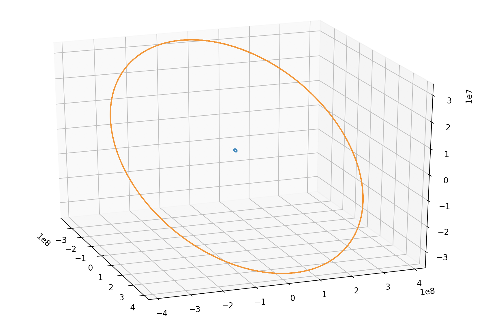
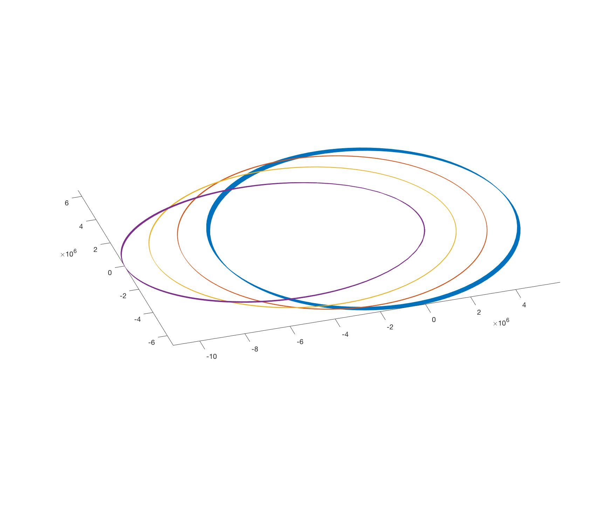

# Gravitational N Body Simulation
## Introduction
This software uses the Hermite integration scheme described [here](https://conference.sdo.esoc.esa.int/proceedings/sdc7/paper/14/SDC7-paper14.pdf) to integrate Newtons Law of Gravitation to predict the motion of bodies. I started this project out of interest in N Body simulation and to aid my learning about simulation methods. Gravitational N Body Simulation (Sverre J. Aarseth, 2003) was also consulted in the design.
## Use
The easiest way to use the program is to create a start file with the format where information enclosed in <these> is what needs to be filled in(r is position and v is velocity):
```
#Body,<name>,<mass>,<initial r_x>,<initial r_y>,<initial r_z>,<initial v_x>,<initial v_y>,<initial v_z>
#Burn,<body name>,<start time>,<end time>,<acceleration>,<orientation x>,<orientation y>,<orientation z>,<orientation rate x>,<orientation rate y>,<orientation rate z>
```
It requires some effort to calculate this information. It is interesting to use data from [NASAs Horizon](https://ssd.jpl.nasa.gov/horizons.cgi?s_target=1#top) as was used in the Earth Moon and Solar System Examples

The program then needs to be written with the following basic structure:
```
#include "main.cpp"
int step;
long double steps, endtime;

int main(){
    System sys;
    sys.SetStartTime(<start time>);
    sys.timestep = <timestep>;
    sys.LoadFile(<start file name>);
    sys.SetOutToFile(<output file name>,<output rate/steps per output>);
    endtime = <end time>;
    steps = endtime/sys.timestep;
    for(step=0;step<steps;step++){
        sys.Output();
        sys.Step();
    }
}
```

The results are output in the following format:
```
#<time>
Body id, mass, r_x, r_y, r_z, v_x, v_y, v_z
```
To plot the results of the simulation you can use the script draw.py, to do this open a python terminal and use the code as below
```
from draw import *
draw(<star file name>,<output file name>)
```
Alternatively, you can open plot.cpp and change the start file and output file at the bottom to yours and run it and then use the MATLAB script *draw.m* by calling it like:
```
draw(<start file name>)
```

## Examples
### Earth Moon System
The start file for the Earth Moon system and an example are included. This shows the movement around the barycentre and is a good example of two body motion with two significant masses.

### Solar System Major Bodies
Below is an example of the Sun, Earth, Jupiter, Saturn and Neptune.

### Circularisation Burn
The below example shows a circularisation burn after 3.5 orbits in an eccentric orbit followed by 1.5 orbits in the new circularised orbit. This demonstrates the ability to program in course changes, the start file shows how this can be implemented.

## Accuracy
The accuracy of the integration system can be analysed as described in the paper. To test the accuracy a series of different 2 body problems were performed, and it was shown that for an eccentricity of between 0.1 and 0.9 it is possible to get less than 0.0001m accuracy after many orbits. It was established that for the range of 0.1 to 0.7 eccentricity and 3000 to 10000 function calls per orbit the error approximately followed the relationship \epsilon = e^{4.55E-0.000136n-2.08} where E is the eccentricity, n is the number of function calls per orbit and \epsilon is the error in the position. This range is appropriate for LEO objects and therefore it is shown that the simulation is appropriate for objects in LEO. An error as described by the function in Section 3 in the paper is also shown to be achieved.

A test is incliuded where the program was propogated for 10000 steps with the eccentricities 0.1,0.3,0.5,0.7 and 1709,8400,15091 and 21782 steps respectivly (from the relationship established above), this test took an extremely long time to run and I have not had a chance to check the numerical accuracy of the propogation but the figure below shows that it hold at least on the percevable scale. It is not helped by the fact that the program only saved the position every 1.01 orbits so it is very hard to test the datas accuracy, had I just saved the final position which should have been at the starting position then there would have been at least that point to test the accuracy from. I will complete this at some point.

It should be noted from this image that the relationship does seem to have calculated the required number of steps much better for the less extreme eccentricities (not 0.1). 

More evidence for the accuracy will follow.

The data showing this is included in the Accuracy Test section but is very poorly formatted.
## Improvements
- Implement variable timestep functionality whereby the timestep varies as given in the book
- Implement block timesteps where objects timesteps are floored to the nearest negative power of two and objects in each group are simulated in together allowing objects requiring more precision to be simulated separately from those that don't
- Allow bodies radius to be defined so that draw.py can then depict it 
- Make draw.py have animation option
- Add other forces like solar winds


# Parallel Programming 

Multicore and RAM 
-the ECE Workstations Lab machines are named "ugNNN.eecg.utoronto.ca, and are
        located in GB243 (ug132.eecg - ug180.eecg), GB251E (ug226.eecg -
        ug249.eecg), SF2102 (ug201.eecg - ug225.eecg), and SF4102 (was SF2204)
        (ug51.eecg - ug80.eecg).  The current door code is 16384.
        Renovations in SF4102 are not yet complete so in-person use of that room is delayed.

Use "ruptime -l" to find the least-used machines.


All the machines in the range from ug51.eecg - ug80.eecg have Nvidia GPU
cards installed.  But these are new machines, and we're having problems
(due to a BIOS or X11 configuration issue) with the cards "disappearing",
so you should check with the "nvidia-smi" command.

There are also two new GPU-equipped server machines, ug252.eecg and
ug253.eecg: please let me know if you try these, because I don't think
anyone has tested them yet.


#### SSH into computer
```sh
$ssh chenhsu2@ug54.eecg.toronto.edu 
```

```sh
ug54:~% nvidia-smi
Fri Dec  2 15:01:48 2022       
+-----------------------------------------------------------------------------+
| NVIDIA-SMI 470.141.03   Driver Version: 470.141.03   CUDA Version: 11.4     |
|-------------------------------+----------------------+----------------------+
| GPU  Name        Persistence-M| Bus-Id        Disp.A | Volatile Uncorr. ECC |
| Fan  Temp  Perf  Pwr:Usage/Cap|         Memory-Usage | GPU-Util  Compute M. |
|                               |                      |               MIG M. |
|===============================+======================+======================|
|   0  NVIDIA GeForce ...  On   | 00000000:01:00.0 Off |                  N/A |
| 33%   29C    P8    16W / 220W |      1MiB /  7974MiB |      0%      Default |
|                               |                      |                  N/A |
+-------------------------------+----------------------+----------------------+
                                                                               
+-----------------------------------------------------------------------------+
| Processes:                                                                  |
|  GPU   GI   CI        PID   Type   Process name                  GPU Memory |
|        ID   ID                                                   Usage      |
|=============================================================================|
|  No running processes found                                                 |
+-----------------------------------------------------------------------------+
ug54:~% 

```


#### Copy myfile from your local computer to ugXXX 
```sh

git branch -a
git clone -b openmp https://github.com/JohnZ03/Gravitational-N-Body-Simulation.git
```

The machines stats used for testing can be found by: 
```sh
wmic cpu get caption, deviceid, name, numberofcores, maxclockspeed, status

lscpu


```

## Running the program
g++ -o run run.cpp

Testing against 9 bodies over long time 
Testing against 9 bodies over short time 

Testing against 2 bodies over short time 
Testing against 2 bodies over long time 


## To run the serial version
```sh
$ g++ -o run_seq run_seq.cpp
$ ./run_seq


ug54:~/final/Gravitational-N-Body-Simulation% g++ -o runSeq runSeq.cpp
ug54:~/final/Gravitational-N-Body-Simulation% time ./runSeq

6.411u 0.003s 0:06.58 97.4%    0+0k 0+34264io 0pf+0w
6.444u 0.008s 0:06.62 97.2%    0+0k 0+34824io 0pf+0w

```

## To run the OpenMP version
```sh
$ g++ -o run_omp run_omp.cpp -fopenmp
$ ./run_omp
g++ -o runOmp -fopenmp runOmp.cpp
g++ -o runOmp runOmp.cpp -fopenmp
time ./runOmp
```

## To run the CUDA version
```sh
$ nvcc -o run_cuda run_cuda.cu
$ ./run_cuda
```


lscpu
Model name:                      11th Gen Intel(R) Core(TM) i7-11700 @ 2.50GHz
ug54:~/final/Gravitational-N-Body-Simulation% grep MemTotal /proc/meminfo
MemTotal:       32621096 kB


Timestamp                                 : Fri Dec  2 15:53:47 2022
Driver Version                            : 470.141.03
CUDA Version                              : 11.4

Attached GPUs                             : 1
GPU 00000000:01:00.0
    Product Name                          : NVIDIA GeForce RTX 3070
    Product Brand                         : GeForce
FB Memory Usage
        Total                             : 7974 MiB
        Used                              : 1 MiB
        Free                              : 7973 MiB
