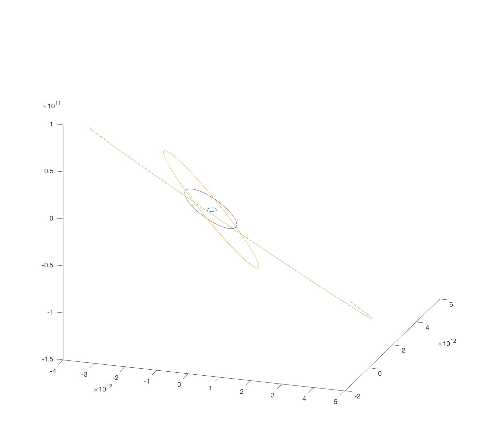

# Gravitational N Body Simulation
## Introduction
This software uses the Hermite integration scheme described [here](https://conference.sdo.esoc.esa.int/proceedings/sdc7/paper/14/SDC7-paper14.pdf) to integrate Newtons Law of Gravitation to predict the motion of bodies. I started this project out of interest in N Body simulation and to aid my learning about simulation methods. Gravitational N Body Simulation (Sverre J. Aarseth, 2003) was also consulted in the design.
## Use
The easiest way to use the program is to create a start file with the format where information enclosed in <these> is what needs to be filled in(r is position and v is velocity):
```
#Body,<name>,<mass>,<initial r_x>,<initial r_y>,<initial r_z>,<initial v_x>,<initial v_y>,<initial v_z>
#Burn,<body name>,<start time>,<end time>,<acceleration>,<orientation x>,<orientation y>,<orientation z>,<orientation rate x>,<orientation rate y>,<orientation rate z>
```
It requires some effort to calculate this information. It is interesting to use data from [NASAs Horizon](https://ssd.jpl.nasa.gov/horizons.cgi?s_target=1#top) as was used in the Earth Moon and Solar System Examples

The program then needs to be written with the following basic structure:
```
#include "main.cpp"
int step;
long double steps, endtime;

int main(){
    System sys;
    sys.SetStartTime(<start time>);
    sys.timestep = <timestep>;
    sys.LoadFile(<start file name>);
    sys.SetOutToFile(<output file name>,<output rate/steps per output>);
    endtime = <end time>;
    steps = endtime/sys.timestep;
    for(step=0;step<steps;step++){
        sys.Output();
        sys.Step();
    }
}
```

The results are output in the following format:
```
#<time>
Body id, mass, r_x, r_y, r_z, v_x, v_y, v_z
```
To plot the results of the simulation you can use the script draw.py, to do this open a python terminal and use the code as below
```
from draw import *
draw(<star file name>,<output file name>)
```
Alternatively, you can open plot.cpp and change the start file and output file at the bottom to yours and run it and then use the MATLAB script *draw.m* by calling it like:
```
draw(<start file name>)
```
## Examples
### Earth Moon System
The start file for the Earth Moon system and an example are included. This shows the movement around the barycentre and is a good example of two body motion with two significant masses.

### Solar System Major Bodies
Below is an example of the Sun, Earth, Jupiter, Saturn and Neptune.

### Circularisation Burn
The below example shows a circularisation burn after 3.5 orbits in an eccentric orbit followed by 1.5 orbits in the new circularised orbit. This demonstrates the ability to program in course changes, the start file shows how this can be implemented.

## Accuracy
The accuracy of the integration system can be analysed as described in the paper. To test the accuracy a series of different 2 body problems were performed, and it was shown that for an eccentricity of between 0.1 and 0.9 it is possible to get less than 0.0001m accuracy after many orbits. It was established that for the range of 0.1 to 0.7 eccentricity and 3000 to 10000 function calls per orbit the error approximately followed the relationship \epsilon = e^{4.55E-0.000136n-2.08} where E is the eccentricity, n is the number of function calls per orbit and \epsilon is the error in the position. This range is appropriate for LEO objects and therefore it is shown that the simulation is appropriate for objects in LEO. An error as described by the function in Section 3 in the paper is also shown to be achieved.

More evidence for the accuracy will follow.

The data showing this is included in the Accuracy Test section but is very poorly formatted.
## Improvements
- Implement variable timestep functionality whereby the timestep varies as given in the book
- Implement block timesteps where objects timesteps are floored to the nearest negative power of two and objects in each group are simulated in together allowing objects requiring more precision to be simulated separately from those that don't
- Allow bodies radius to be defined so that draw.py can then depict it 
- Make draw.py have animation option

